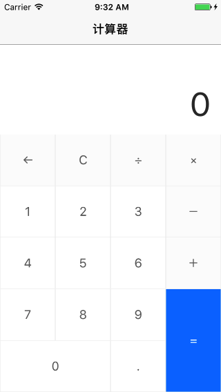

# Calculator
Simple **Calculator** in Swift.

## Screenshot



## Installation

### Carthage

```swift
github "cp3hnu/Calculator"
```

* Drag and drop *Calculator.framework* from /Carthage/Build/iOS/ to *Linked Frameworks and Libraries* in Xcode (Project>Target>General>Linked Frameworks and Libraries

* Add new run script

  ```ruby
  /usr/local/bin/carthage copy-frameworks
  ```

* Add Input files *$(SRCROOT)/Carthage/Build/iOS/Calculator.framework*

